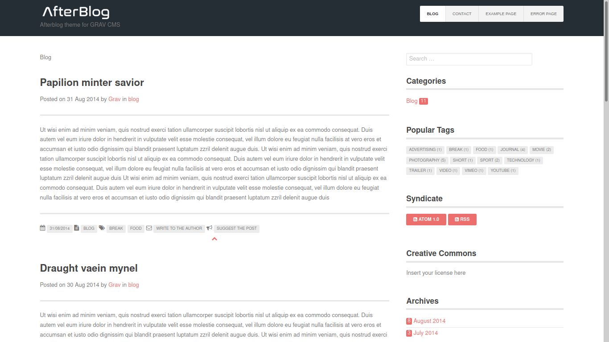

# Afterblog

Afterblog is inspired by the [Grav template Afterburner 2.0](https://github.com/getgrav/grav-theme-afterburner2).

The purpose of the Afterblog theme is to bring the typical user experience of Wordpress themes to Grav (especially for blogs).

For a better use of this theme it is recommended to install the following plugins:
- AboutMe (it is recommended to create a page called "about")
- Pagination
- SimpleSearch
- Taxonomy List

From version 0.9.0 on the main page of the *Blog* are shown completely only the
first N articles (where N is definable in theme's variable) while all previous
articles are shown in "compress" or "short" form.

## Manual Installation
To install this theme, just download the zip version of this repository and unzip it under /your/site/grav/user/themes. Then, rename the folder to afterblog. You can find these files either on GitHub.

You should now have all the theme files under
'/your/site/grav/user/themes/afterblog'
NOTE: This theme is a modular component for Grav which requires the Grav, Error and Problems plugins.

## Manual Installation directly in Grav Admin
Download the zip version of this repository and rename in "afterblog.zip". From Admin -> Tools -> Direct Install, then upload the file with "Install Package via Direct ZIP Upload"

## Setup
If you want to set Afterblog as the default theme, you can do so by following these steps:

Navigate to /your/site/grav/user/config.
Open the system.yaml file.
Change the theme: setting to theme: afterblog.
Save your changes.
Clear the Grav cache. The simplest way to do this is by going to the root Grav directory in Terminal and typing bin/grav clear-cache.
Once this is done, you should be able to see the new theme on the frontend. Keep in mind any customizations made to the previous theme will not be reflected as all of the theme and templating information is now being pulled from the afterblog folder.
